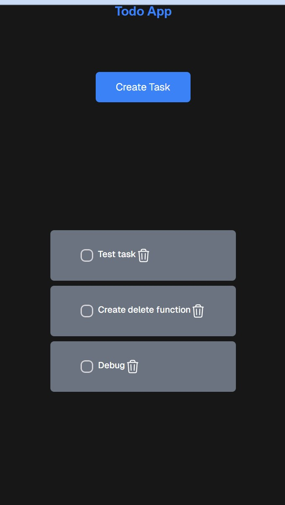
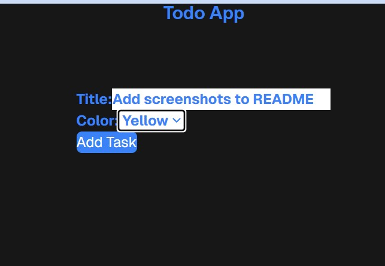

# Next.js frontend of Daniel Boren's submission for Todo App assignment

## Overview
This app allows users to create and manage a todo list by creating, viewing, and deleting tasks. This repo contains the Next.js based frontend component of the app. The repo for the backend can be found at https://github.com/dboren/db-nooro-todo-back2

## To run the app

App is not currently deployed but can be run locally. To do so:

Make sure your .env file in the backend repo contains the variable DATABASE_URL set to the value of your desired mysql database.

In the terminal for the backend, run "npm run start" to launch the server

In a terminal for the frontend of the app (separate repo), run "npm run dev" from within nooro-todo-front directory

Navigate to localhost:3000 in your web browser

You will now be vewing the homepage of the app.

 

## Using the app

If there are any existing tasks in your database, they will display vertically as a list of cards on the front page.

Clicking the trashcan icon of any task card will remove it from the page and send a call to the server to delete it from the database.     

Clicking the "create task button" will navigate you to the create task form.

From here, users can enter the text of their new task and select a color to code it with. Clicking the "add task" button will then add the new task to the database. 

## Tech Stack
next.js - react-based framework

tailwind - styling

axios - utilized to make calls to the server

heroui - Additional styling elements

 

(Backend Below)

Express.js - server, GET & POST routes

Prisma - ORM for database interaction

MySQL - database

 

This repo can be found at https://github.com/dboren/db-nooro-todo-front

The repo for the backend of the app can be found at https://github.com/dboren/db-nooro-todo-back2

